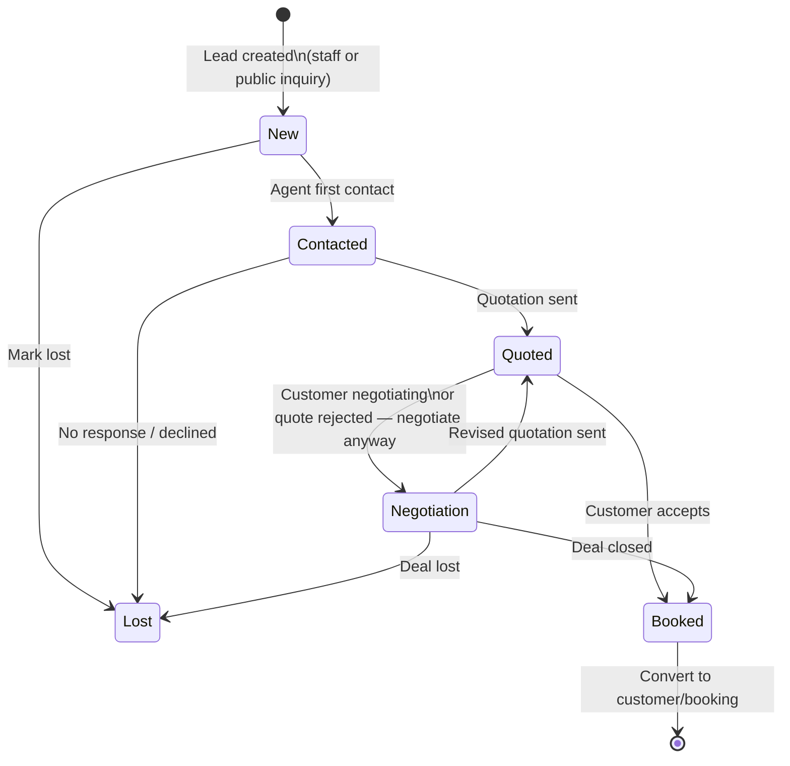
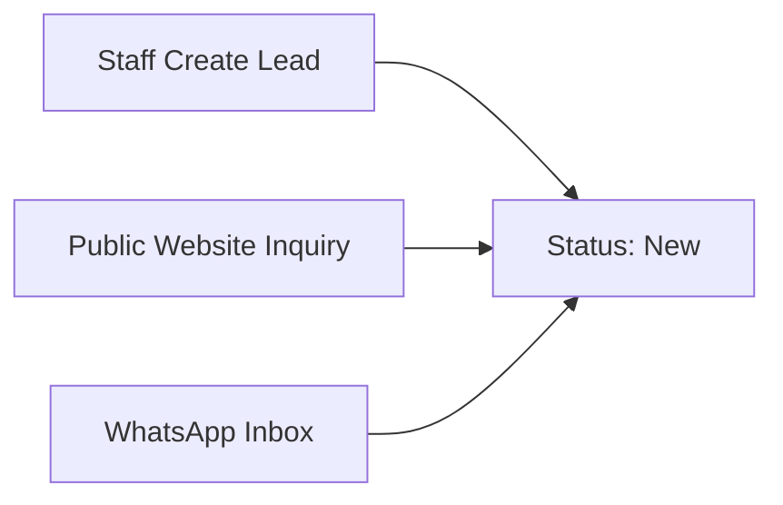

# Lead Lifecycle — Alsultania Travel CRM

| Field | Value |
|---|---|
| **Document** | Lead Lifecycle — Client Summary |
| **Version** | 1.0 |
| **Date** | 24 June 2026 |
| **Client** | Alsultania Travel and Tourism Co. L.L.C — Dubai, UAE |
| **Vendor** | AnyMatch Technologies Private Limited |
| **SRS Baseline** | [`SRS.md`](../requirements/SRS.md) v1.0 §4.1.3 |
| **Diagram source** | [`lead-lifecycle.mmd`](../diagrams/lead-lifecycle.mmd) |

---

## Purpose

This document explains how a travel inquiry moves through the CRM from first capture to a confirmed booking. It summarises the six pipeline stages, allowed status changes, entry points, and key agent actions defined in the Phase 0 blueprint.

---

## Overview

Every lead in the Alsultania CRM is tracked through a **six-stage pipeline**. Agents see this pipeline as a Kanban board on the **Pipeline** screen and as a status badge on each **Lead Detail** page.

All new leads — whether created by staff, submitted by a guest on the login page, or captured from WhatsApp — start at **New**.

---

## Lifecycle diagram



**Key callouts**

- **New** — Public website inquiries are automatically assigned to the next available active agent (round-robin).
- **Booked** — The agent converts the lead to a customer and creates a Draft booking. The lead lifecycle ends here; the booking lifecycle continues separately.

---

## Pipeline stages

| Stage | Meaning | Typical agent action |
|---|---|---|
| **New** | Lead just created; awaiting first contact | Review assignment, open Lead Detail, make first outreach (call or WhatsApp) |
| **Contacted** | Agent has reached the customer | Gather requirements, send follow-up, prepare quotation |
| **Quoted** | Quotation sent to the customer | Follow up on the quote; if rejected, move to **Negotiation** to discuss revised terms rather than closing as Lost |
| **Negotiation** | Customer is discussing terms or price | Negotiate package, dates, or pricing; send a revised quote (returns to **Quoted**), close as **Booked**, or mark **Lost** |
| **Booked** | Deal won; ready for customer and booking setup | Convert to customer, create linked Draft booking |
| **Lost** | Lead closed without conversion | Record reason in notes; no further pipeline action |

---

## Allowed status transitions

Status is not a free-text field. The system only permits moves that follow the pipeline rules below.

| From | Can move to |
|---|---|
| **New** | Contacted, Lost |
| **Contacted** | Quoted, Lost |
| **Quoted** | Negotiation, Booked |
| **Negotiation** | Quoted, Booked, Lost |
| **Booked** | *(terminal — convert to customer/booking)* |

Invalid jumps (for example, moving directly from **New** to **Quoted**) are blocked so pipeline reporting stays accurate.

---

## How leads enter the pipeline



| Entry path | What happens |
|---|---|
| **Staff** | Agent creates a lead from the Dashboard, Leads List, Pipeline, or WhatsApp Inbox. Status defaults to **New**. Assignment follows the agent’s Lead Handling choice (handle myself, create for another agent, or transfer). |
| **Guest inquiry (login page)** | Guest verifies their phone with a one-time SMS code on the login page, completes the inquiry form, and submits. Status is set to **New**, `lead_via` is Website, and the lead is auto-assigned to the next available agent. The guest sees a confirmation reference only. |
| **WhatsApp** | An inbound WhatsApp message is captured in the inbox. The agent creates or links a lead from the conversation. Status starts at **New**. |

---

## End of the lead lifecycle

When a lead reaches **Booked**:

1. The agent **converts the lead to a Customer** (if one does not already exist).
2. The agent **creates a linked Draft Booking** — lead fields prefill the booking form.
3. The lead lifecycle is complete. The booking then moves through its own status flow (Draft → Confirmed → In Progress → Completed, or Cancelled).

The system prompts the agent to create a booking when saving **Booked** if no booking is linked yet.

---

## Where agents work

| Screen | Blueprint preview | Role in the lifecycle |
|---|---|---|
| **Pipeline** | [`prototype/pipeline.html`](../../prototype/pipeline.html) | Kanban view of all six stages; drag leads to update status |
| **Lead Detail** | [`prototype/lead-detail.html`](../../prototype/lead-detail.html) | View profile, change status, activity timeline, send WhatsApp, create quotation, convert to customer |
| **Leads List** | [`prototype/leads-list.html`](../../prototype/leads-list.html) | Search and filter leads by status; bulk assignment for managers |

> The HTML prototype is an interactive blueprint preview for review and sign-off — not production software.

To preview locally:

```bash
cd prototype && php -S 127.0.0.1:8765
```

Then open http://127.0.0.1:8765/pipeline.html

---

## Related automations

| Rule | What it does |
|---|---|
| **AUTO-02** | Auto-assigns guest inquiries to the next available active agent on creation |
| **AUTO-04** | Sends WhatsApp notifications to the agent and customer when lead status changes *(Phase 3 — Automation module)* |
| **Activity timeline** | Every status change is logged on Lead Detail alongside messages, assignments, and notes |

---

## Delivery scope

Lead lifecycle management — capture, pipeline, status tracking, and WhatsApp-integrated follow-ups — is delivered in **Phase 1: Core CRM** (Screens 01–12).

Full functional requirements: [`SRS.md`](../requirements/SRS.md) §4.1.3 Advanced Lead Management.

---

*Document version 1.0 · SRS v1.0 baseline · Alsultania Travel CRM Phase 0 Blueprint*
